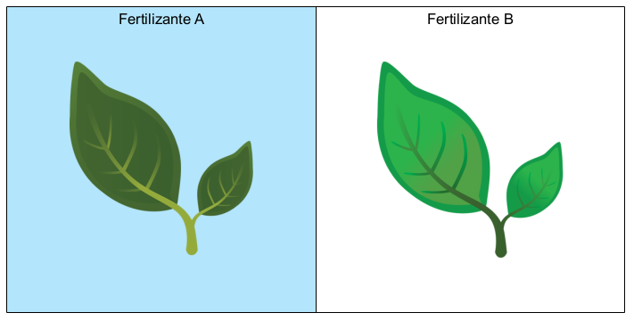
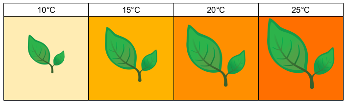

```{r setup, include=FALSE}
knitr::opts_chunk$set(echo = TRUE)
```

# Introducción

La ecología y biología son cada vez más sofisticadas, por lo que es imposible aprender todos los tipos de estudios que existen. En general, con motivo de diseño podemos clasificar a los estudios en tos tipos:

- **Observacionales** Consisten en el registro sistemático de acontecimientos del mundo natural (ejemplo de la ardilla).
- **Experimentales** Están basados en la creación de un ambiente donde podemos controlar los factores que afectan el objeto de estudio.

Como es de esperarse, hay grados intermedios pues, por ejemplo, se puede hacer experimentos a gran escala (ecosistemas enteros) donde tenemos poco control sobre muchos de los factores que afectan el comportamiento del sistema de estudio.

Es importante tener en cuenta esta burda clasificación, porque durante nuestra carrera podremos vernos en la necesidad de diseñar ambos tipos de estudios. Tal como mencionamos anteriormente, para diseñar experimenton hay que considerar factores biológicos, estadísticos, éticos y logísticos. Cuando decidimos si hacemos estudios observacionales o experimentales, debemos de tomar en cuenta los mismos factores y otros adicionales, pues ambos tipos de estudios tienen ventajas y desventajas tanto biol\'ogicas como estadísticas:

- **Biológicas** Los estudios experimentales son versiones muy simplificadas del mundo, por lo que podremos registrar con mayor certeza el fenómeno que nos interesa. Sin embargo, la ventaja de los estudios observacionales es que son mucho más realistas que los estudios experimentales. Por otra parte, los estudios experimentales pueden ser tan simplistas que los resultados obtenidos pueden tener implicaciones insignificantes en el mundo real. De igual manera, los estudios observacionales están afectados por tantos procesos paralelos que la variabildiad (error) es muy alta, resultando muy difícil haer generalizaciones a partir de lo que veamos.
- **Estadísticas** Debido a que los estudios experimentales son más sencillos que los observacionales es más fácil estimar adecuadamente los errores y explicar la variabildiad que en los estudios observacionales. Por lo tanto los métodos estadísticos utilizados para los estudios experimentales son generalmente más sencillos. Por otra parte, mientras que en los estudios observacionales es más complicado probar hipótesis o estimar efectos, estos se prestan más para expandir los límites de los métodos estadésticos.

A partir de aquí veremos una clasificación más profunda de los estudios (experimentos) con base en sus cualidades estadísticas, las cuales determinarán la naturaleza de las observaciones que obtendremos y el tipo de análisis que se puede hacer de ellas.

# Tipos de experimentos

En este curso profundizaremos en los experimentos factoriales, que como su nombre indica están basados en  probar si dos o más factores distintos afectan el comportamiento de la variable de inter\'es. Este tipo de diseños experimentales fueron desarrollados por ingenieros agrónomos, por lo que los ejemplos básicos ser\'an con plantas. Para comenzar hagamos un breve recordatorio de los tipos de variables que hay:

- **Contínuas** Se pueden medir con números racionales, es decir con decimales o fracciones: *distancia, peso, tiempo, temperatura, volumen, precio*. Aquí es necesario indicar que hay variables contínuas que sólo pueden tomar valores positivos (p. ej.  tiempo).
- **Discretas** Se pueden medir con números, pero no con fracciones: *número de individuos, conteos en general*.
- **Categóricas** Indican cualidades, no cantidades: *colores, sustancia química, nombres, sexo*.

Y por su función en el experimento podemos clasificar a las variables como:

- **Dependientes** Son las variables o cantidades que analizaremos y sobre las cuales elaboramos una hipótesis.
- **Independientes** Son las que afectan la magnitud de la variable **dependiente** y que utilizamos para explicar su comportamiento.

A estas variables también se les llama de **respuesta** (dependiente) y **explicativa**  (independiente). Estos nombres provienen de la idea matemáticas de las funciones:

$$ f(x) = a + b \cdot y$$ 

Donde $x$ (variable dependiente) es una función de $y$ (variable independiente).

A continuación se expone una serie de ejemplos para dejar de manifiesto las implicaciones experimentales de las cualidades matemáticas y estadísticas de las variables.

## Aplicación de dos fertilizantes {#fert}

Estamos trabajando con una especie de planta y nos interesa saber qué fertilizante funciona mejor para que produzca más fruto. Entonces creamos dos parcelas dentro de un invernadero, donde colocamos 100 plantas, a 50 de ellas les aplicaremos el fertilizante *A* y a las otras 50 el fertilizante *B*. Durante una temporada de producción medimos la producción de fruto.

Claramente, en este experimento la variable de interés es la **producción de fruto** (dependiente), la cual es contínua. La variable que va a afectar la producción de fruto es el **fertilizante** (categórica e independiente).

```{r echo=F, out.width="50%", fig.cap="Esquema del diseño experimental con factor a dos niveles.", fig.align='center'}

```

Este es un experimento donde la variable independiente (fertilizante) es categórica y consta de dos niveles, los cuales constituyen los *tratamientos*. De este modo, podemos hacer una comparación visual de la producción de fruto obtenida con cada tratamiento, donde la línea gruesa de en medio muestra el promedio en kilogramos al final del experimento:

```{r box-plots, echo=F, fig.width=4, fig.height=4, fig.align="center", fig.cap="Visualización de la distribución de la producción en cada tratamiento."}

x <- rnorm(50, mean = 50, sd = 10)
x1 <- rnorm(50, mean = 56, sd = 11)

trat <- rep(c("A", "B"), each = 50)

df <- data.frame(prod = c(x, x1), tratamiento = trat)

library(ggplot2)

ggplot(df) + geom_boxplot(aes(x = tratamiento, y = prod))

```

## Efecto de la temperatura

Estamos interesados en determinar si la temperatura afecta la productividad de la planta. Por lo que diseñamos un experimento para medir la producción de fruto a diferentes temperaturas (10-25 °C). Entonces decidimos que vamos a aplicar cuatro tratamientos con 12 plantas cada uno: 10, 15, 20 y 25 °C. Como pueden ver, aquí sería posible haber seleccionado más temperaturas intermedias, pues la temperatura es una variable **contínua**.

```{r echo=F, out.width="75%", fig.cap="Esquema del diseño experimental con factor contínuo a cuatro niveles.", fig.align='center'}

```

De este modo, medimos la producción por planta (contínua, dependiente) en función de la temperatura (contínua, independiente). Aquí es más fácil concebir la producción como una ecuación lineal:

$$ Producción = a + b \times Temperatura$$

Y los datos se prestan para ser representados como una función lineal:

```{r, echo=F, fig.width=4, fig.height=4, fig.align="center", fig.cap="Relación entre las temperaturas experimentales y la producción. Aquí es aparente que la producción aumenta con la temperatura.", warning=F, message=F}
x1 <- rnorm(12, 30, 8)
x2 <- rnorm(12, 34, 8)
x3 <- rnorm(12, 38, 8)
x4 <- rnorm(12, 42, 8)

temp <- rep(c(10, 15, 20, 25), each = 12)

df <- data.frame(prod = c(x1, x2, x3, x4), Temp = temp)

ggplot(df) + geom_point(aes(x = temp, y = prod)) + 
      geom_smooth(aes(x = temp, y = prod), method = "lm")

```

## Discusión de los ejemplos {#disc}

Aquí vimos dos ejemplos sumamente sencillos, uno con un factor categórigo a dos niveles, y un factor contínuo a do niveles. En la práctica es necesario tomar en cuenta muchos otros factores externos que pueden afectar los resultados que obtenemos. Por ejemplo, en el experimento de los fertilizantes, es posible que si dividimos el invernadero tal como se muestra en la figura, un lado de este tenga más sol que el otro, afectando la producción del mismo modo que el fertilizante. Por lo tanto tendríamos que introducir un modo diferente de arreglar las parcelas o las plantas. Una alternativa, quizás más robusta, sería poner las plantas en macetas del tamaño suficiente e intercalar los tratamientos *A* y *B*, como en un tablero de ajedrez con dos cuadros del mismo color intercalados, para eliminar el posible efecto del lado del invernadero:

```{r fisher-plots, echo = F, fig.height=4, fig.width=5, fig.cap= "Diseño experimental alternativo en modo de tablero de ajedrez.", fig.align="center"}
Trats <- expand.grid(x = seq(2, 20, by = 2), y = seq(1, 10, by = 1))

Trats$Tratamiento <- rep(c("A", "B", "B", "A"), 25)

ggplot(Trats) + geom_point(aes(x = x, y = y, colour = Tratamiento), size = 3) +
      labs(x = "", y = "") +
      theme(axis.text = element_blank(),
            axis.ticks = element_blank())
```

Este diseño experimental fue desarrollado por el famoso estadístico R. A. Fisher en la estación experimental de Rothamsted, Londres. Es obvio que un experimento de este tipo sería imposible para aplicar tratamientos de temperatura (segundo ejemplo), pues no podríamos controlar la temperatura como sí se puede controlar el tipo de fertilizante aplicado.

Existen alternativas a este diseño que también podrían dar mejores resultados que el diseño original del ejemplo. El cuadrado latino, por ejemplo, está basado en parcelas arregladas en filas y columnas tal que cada fila y cada columna debe tener una parcela de cada tratamiento:

```{r cuadrado-latino, echo = F, fig.height=4, fig.width=5, fig.cap="Diseño de cuadrado latino.", fig.align="center"}
df.1 <- data.frame(x = c(1, 1, 2, 2), y = c(1, 2, 1, 2), Tratamiento = c("A", "B", "B", "A"))
ggplot(df.1) + geom_tile(aes(x = x, y = y, fill = Tratamiento)) +
            labs(x = "", y = "") +
      theme(axis.text = element_blank(),
            axis.ticks = element_blank())
```

Existen muchas variaciones de este tipo de arreglos de los tratamientos experimentales, algunos de los cuales pueden ser muy complejos, sobretodo cuando aplicamos tratamientos con tres, cuatro niveles o más niveles (tres o cuatro fertilizantes); o combinaciones de tratamientos, por ejemplo combinando tres fertilizantes en dos tipos de suelo diferentes. Algunos de los diseños experimentales que revisaremos a profundidad junto con los métodos estadísticos para analizarlos son:

1. Diseño completamente aleatorizado
2. Diseño de bloques aleatorizados
3. Diseño de parcelas divididas
4. Cuadrado latino

Estos estudios más complicados se llaman **multi-factoriales**. Lo que todos estos diseños experimentales tienen en común es que los datos se suelen analizar con un **Análisis de Varianza** (**ANOVA** por "Analysis of Variance", sus siglas en inglés). En la unidad 2 comenzaremos a ver por qué recibe este nombre y cómo se puede hacer dicho análisis estadístico.

## Conclusiones de los ejemplos

En el primer ejemplo probamos si un fertilizante es mejor que otro, es decir: diseñamos dos tratamientos y utilizamos la estadística para aceptar o rechazar la **hipótesis nula** ($H_0$) de no-diferencia entre tratamientos. En el segundo caso, probamos si la temperatura afecta la producción de las plantas, y como la temperatura es contínua, diseñamos un experimento para **estimar el efecto** de la temperatura (parámetro $b$ de la ecuación lineal de arriba!).

Generalmente, es más fácil interpretar los resultados de los experimentos con variables contínuas, por lo que nos centraremos en profundizar en los experimentos donde las variables independientes son categóricas ($1^{er}$ ejemplo).

### Verifiación del aprendizaje


## Tipos de observaciones 

En la sección \@ref(fert) vimos un experimento donde acomodábamos 100 plantas en dos parcelas, cada una con 50. En la discusión de esta sección (\@ref(disc)) vimos otras alternativas de diseño experimental. La principal diferencia entre estas fue que en la primera (Figura \@ref(fig:fisher-plots)) no hubo parcela, sino contenedores para cada planta, mientras que en la segunda (Figura \@ref(fig:cuadrado-latino)) acomodamos las plantas en dos parcelas, como en un cuadrado latino. En la primera alternativa, estaríamos registrando la producción por planta, mientras que en la segunda se registraría la producción por parcela. De aquí que tengamos dos tipos de observaciones, una por planta, y otra donde agregamos la producción de las plantas por parcela o bloque. Cada registro que hacemos lo denominamos observación, y los tipos de observaciones aquí descritas son:

1. **Individuales** 
2. **Agrupadas**

Los tipos de observaciones tienen implicaciones importantes para el análisis de los datos colectados, pues durante un experimento obtendremos observaciones tanto de las cantidades que estamos investigando como de aquellas que afectan los datos que analizaremos. Como vimos en la sección \@ref(disc) las condiciones del lugar donde hacemos los experimentos pueden afectar el desempeño de las unidades de estudio (planta individual o parcela/bloque), anulando el efecto de los tratamientos. Estos efectos del diseño experimental son muy comunes, por lo que es necesario tener registros precisos de las condiciones experimentales. Es importante tener un vocabulario consistente para describir los componentes de los diseños experimentales, pues estos componentes forman parte del análisis estadístico. Por lo general:

- **Tratamiento** Es la variable independiente que afecta el comportamiento de la variable dependiente.
- **Bloque** Unidad de réplica del diseño experimental que afecta la dispersión de la variable dependiente.
- **Error** Variabilidad de la variable dependiente que no pudimos explicar al tomar en cuenta los tratamientos o bloques.

La figura \@ref(fig:box-plots) es una comparación de los promedios de los datos obtenidos de dos tratamientos sin bloques. El mismo experimento con bloques está representado en la figura \@ref(fig:cuadrado-latino). Cuando hacemos un análisis de las observaciones de este experimento, podemos aislar el efecto del **bloque** de la siguiente manera:

$$ Observación_{i(j)} = Media_i + Bloque_j + Tratamiento_i + Error_{i(j)}$$

Es decir que el promedio de las observaciones del tratamiento $i$ ($i = (A, B)$) es la suma del promedio global, el promedio del bloque $j$ y el tratamiento $i$.

Aquí podemos ver por qué es necesario tomar en cuenta el tipo de observaciones que obtendremos con el diseño experimental elegido, y de registrar adecuadamente su obicación en los bloques y tratamientos. 

### Verificación del aprendizaje

[Regresar al índice del curso](index.html)