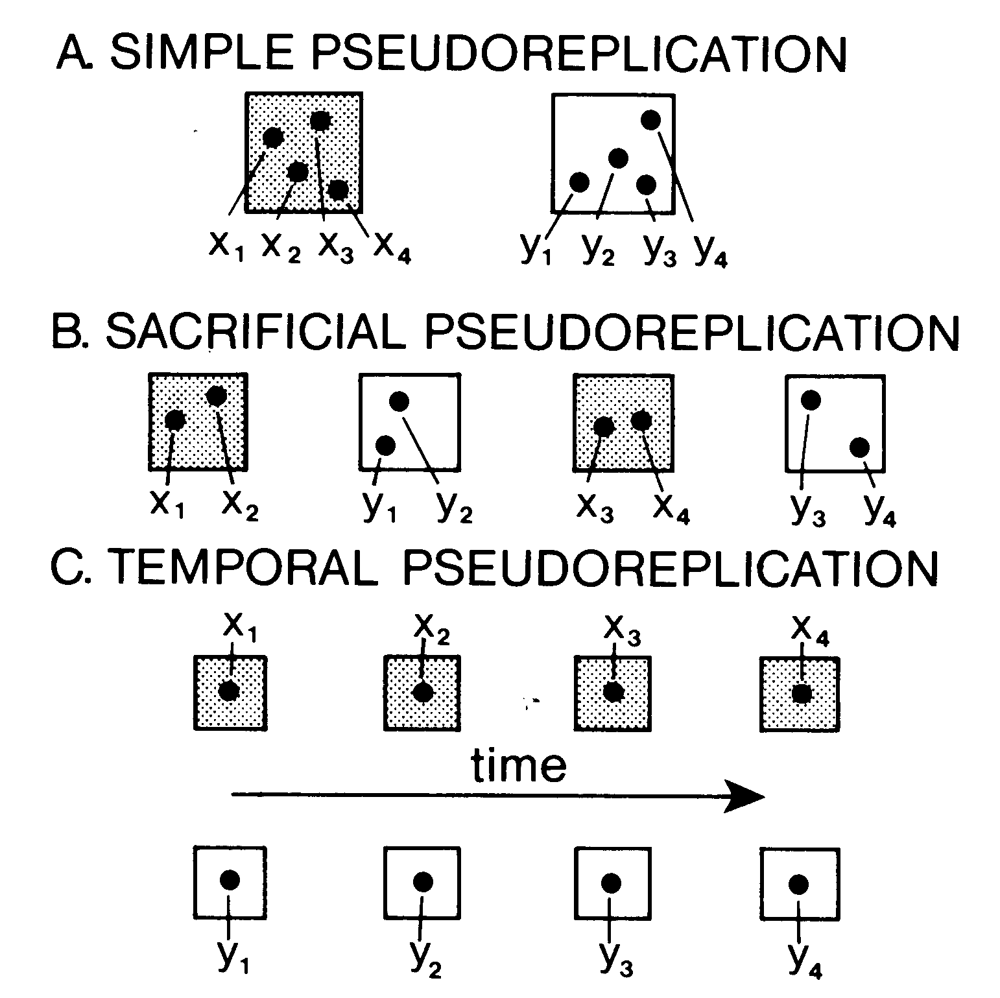
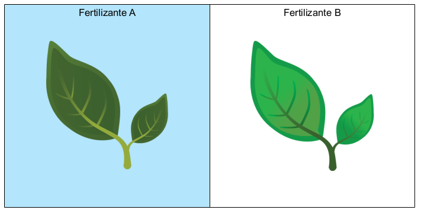
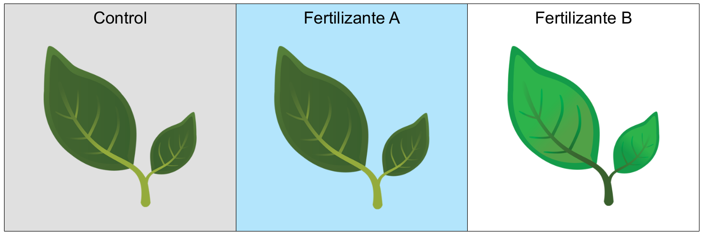

```{r setup, include=FALSE}
knitr::opts_chunk$set(echo = TRUE)
```

# Introducción

El objetivo principal de los experimentos es encontrar respuestas correctas (*verdaderas*) a las preguntas que investigamos. Encontrar las respuestas verdaderas a las preguntas es más fácil si tenemos más información (más datos) sobre el fenómeno que nos interesa. Sin embargo, siempre hay muchas limitaciones (logísticas, financieras, de tiempo) para hacer experimentos lo suficientemente grandes, de modo que es necesario optimizar el diseño experimental para encontrar las respuestas correctas con el mínimo de recursos. Es con este objetivo que se ha diseñado el uso de réplicas y controles. La Pseudo-replicación, como su nombre lo indica es una *replicación falsa* que debemos aprender a identificar pues representa un obstáculo en la identificación de respuestas correctas.

Aquí es necesario hablar del tipo de errores de inferencia a que nos podemos enfrentar. Cuando hacemos un análisis estadístico de datos experimentales, estamos poniendo a prueba la hipótesis nula ($H_0$) de que no hay diferencias entre los tratamientos. El **Error tipo I** consiste en el rechazo de $H_0$ cuando deberíamos haberla aceptado, es decir, los tratamientos experimentales **NO** tuvieron un efecto significativo (sobre la producción de las plantas por ejemplo), pero el análisis (o el diseño experimental) fue deficiente y determinamos que los tratamientos sí funcionaron. El **Error tipo II** consiste en el fenómeno inverso, la aceptación de $H_0$ cuando debimos rechazarla (los tratamientos sí funcionaron pero estadísticamente no lo pudimos demostrar). La presencia de pseudo-replicación puede aumentar la probabilidad de ambos tipos de errores, pero particularmente el tipo **I**.

Ahora ya estamos en condiciones de entender mejor las diferencias entre **réplica**, **control** y **pseudo-réplica**:

- **Réplica** Es la repetición de unidades experimentales de tal modo que cada una es independiente de la otra.
- **Control** Es una unidad experimental que no ha sido sujeta a ningún tratamiento y sirve de referencia o punto de comparación con aquellas que sí estan siendo sujetas a tratamiento.
- **Pseudo-réplica** Es una repetición de unidades experimentales que no se pueden considerar independientes de otras, es decir, el resultado o valor de una hace más probable que el valor de otra sea similar.

En otras áreas de conocimiento el tipo de réplicas y controles como en biología colecular y epidemiología son muy importantes, sin embargo en ecología profundizaremos más en los tipos de pseudo-replicación:

## Tipos de pseudo-replicación

La pseudo-replicación fue descrita formalmente por Hurlbert en el artículo [Pseudo-replication and the Design of Ecological Field Experiments](http://www.uvm.edu/~ngotelli/Bio%20264/Hurlbert.pdf). Ahí, Hurlbert identificó tres tipos básicos de pseudo-replicación:

1. **Simple** Cuando los tratamientos coinciden plenamente con las unidades experimentales
2. **Sacrificial** Cuando los tratamientos se promedian por unidad experimental
3. **Temporal** Cuando hay mediciones repetidas de las unidades experimentales a través del tiempo y el efecto de los tratamientos varía con el tiempo

En dicha publicación seminal, Hurlbert esquematizó estos tipos de pseudo-replicación así:

```{r pseudo, echo = F, out.width="50%", fig.cap="Esquema de tipos de pseudo-recplicación de Hurlbert (1984).", fig.align='center'}

```

# Ejemplos

## Pseudo-replicación simple

En la sección [Tipos de experimentos y observaciones](Tipo-exper-observ.html) vimos un ejemplo muy sencillo para probar la eficiencia de un fertilizante, y lo vimos con el esquema:

```{r fertilizante, echo=F, out.width="50%", fig.cap="Esquema del diseño experimental con factor a dos niveles.", fig.align='center'}

```

Este ejemplo tiene un problema de diseño muy grave, pues no será posible distinguir entre el efecto de los fertilizantes del efecto de la parcela, pues sólo hay una de ellas por cada tratamiento. En este caso las mediciones de producción de las diferentes plantas no serán independientes una de la otra por lo que en realidad tendremos **pseudo-replicación simple**. 

Otro problema con este diseño es que no hay **controles**, es decir, una tercera parcela con el mismo número de plantas a las que no se les haya aplicado ningún tratamiento:

```{r fert-contr, echo=F, out.width="75%", fig.cap="Esquema del diseño experimental con factor a dos niveles y controles.", fig.align='center'}

```

Para terminar de corregir este diseño experimental necesitamos **réplicas** verdaderas, para lo que se puede dividir las plantas dentro de cada parcela en tres bloques diferentes y arreglarlas a modo de **cuadrado latino**:

```{r fert-cuad, echo = F, out.width="75%", fig.cap="Diseño experimental con factor a dos niveles, controles con parcelas en cuadrado latino. Cada tratamiento aparece sólo una vez en cada fila y columna.", fig.align="center"}
knitr::include_graphics("Fertilizante-cuadrado.png")
```

De este modo sí se obtienen 3 réplicas verdaderas, con base en qué tratamiento es vecino de qué tratamiento. Aún así es necesario tomar en cuenta la identidad de cada parcela en el análisis estadístico.

## Pseudo-replicación sacrificial {#sacr}

En muchas ocasiones este tipo de pseudo-replicación es una decisión de procesamiento de datos pues es resultado de agregar las observaciones (ver [sección 1](Tipo-exper-observ.html)). Una manera común de agregación de datos es promediando las observaciones, de modo que los datos de todos los individuos dentro de cada bloque experimental son representados con sólo un número. Suele ocurrir durante el análisis de diseños experimentales como el cuadrado latino (figura \@ref(fig:fert-cuad)).

En caso de agregar las observaciones del experimento de los fertilizantes ¡tendríamos 9 observaciones en lugar 300!:

```{r sacrificial, echo=F, results="asis"}
df <- data.frame(Producción = c(rnorm(3, 30, 8), rnorm(3, 32, 8), rnorm(3, 33, 10)),
                  Tratamiento = rep(c("Control", "Fertlilizante A", "Fertilizante B"), each = 3),
                  Bloque = 1:9)
knitr::kable(df, caption = "Datos experimentales agregados por promedio de bloque.")
```

Este tipo de pseudo-replicación **sacrifica** toda la varibilidad que pudimos hacer utilizado para rechazar la hipótesis nula.

## Pseudo-replicación temporal

Si tomamos en cuenta que algunos experimentos pueden tomar mucho tiempo en llevarse a cabo, resulta muy tentador comenzar a analizar las observaciones registradas conforme avanza el experimento. Más tentador aún es asumir que cada registro puede analizarse como un dato más, sin embargo este método puede anular la validez de las conclusiones a las que lleguemos. Veamos en este esquema a qué se refiere la pseudo-replicación temporal:

```{r fert-cuad-temp, echo = F, out.width="90%", fig.cap="Cuadrado latino con medidas repetidas en el tiempo.", fig.align="center"}
knitr::include_graphics("Fertilizante-cuadrado-tiempo.png")
```

De modo que si colectamos los datos una vez a la semana agregándolos como en \@ref(sacr), asumiendo que cada colecta es independiente, tendríamos una base de datos como la tabla \@ref(tab:sacrificial) con 36 filas, pero donde los bloques 1-9 se repiten cuatro veces. El resultado sería pseudo-replicación temporal y sacrificial.

# Discusión

En al realidad en muy difícil asegurarnos de que las réplicas y unidades experimentales son independientes unas de otras, por lo que existen métodos estadísticos para estimar el grado de dependencia entre observaciones. Sin embargo hay diseños experimentales muy deficientes para los que no existe solución estadística como el de la figura \@ref(fig:fertilizante).

Por otra parte, como hemos visto aquí la agrupación puede representar un problema de pseudo-replicación, pero también hemos visto (sección de [Unidades experimentales](Unidad-exper.html)) que a veces es necesario agrupar las observaciones.

# Verificación del aprendizaje

Sigue [esta liga](https://docs.google.com/forms/d/e/1FAIpQLSd_A4s0bbYsu4UwBjLXdaGlLCQZpG1yuEy7PMAcmCcigOQR0A/viewform?usp=sf_link) para completar la actividad correspondiente a este módulo. Para acceder necesitarás tu dirección institucional.

[Regresar al índice del curso](../index.html)