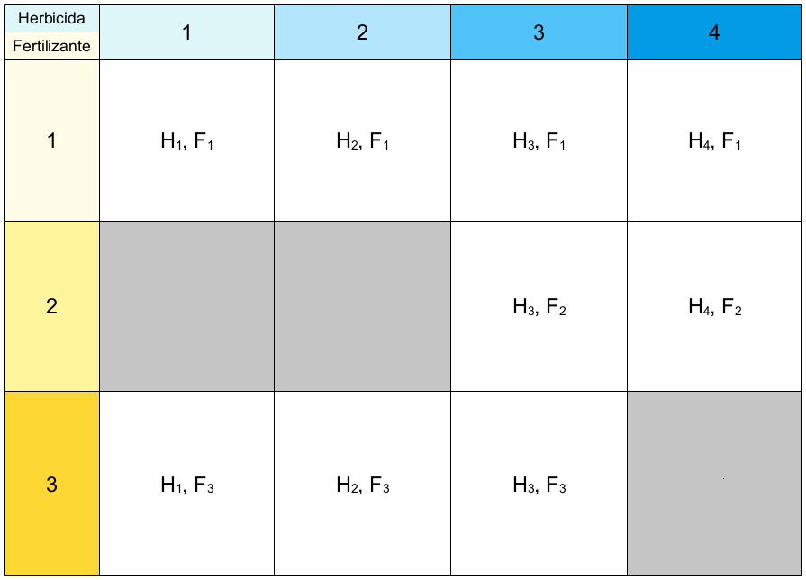

```{r setup, include=FALSE}
knitr::opts_chunk$set(echo = TRUE)
```

# Introducción

Existen varias razones por las que los diseños no balanceados requieren una estrategia diferente de suma de cuadrados:

1. Los tamaños diferentes de muestra implican sumas de cuadrados más altas para los tratamientos con más observaciones
2. La varianza "faltante" en los tratamientos con menos observaciones no puede ser explicada por los tratamientos, pues es simplemente un artefacto del diseño

Es último fenómeno se conoce como "confounding", y la solución en ANOVA es $SS-II$, la cual permite simplemente medir la varianza "faltante" producto de la falta de balance.

Hay muchas razones por las cuales los estudios pueden quedar fuera de balance, desde fallas de diseño, errores o accidentes experimentales u observacionales y hasta dificultades logísticas. 

Existe otro tipo de diseños no balanceados con efectos fijos cuando por ejemplo faltan algunas combinaciones de los niveles de los dos factores experimentales (Figura \@ref(fig:No-balance-1)). Este tipo de diseños también se pueden analizar con $SS-II$.

```{r No-balance-1, echo = F, fig.cap="Diseño experimental no balanceado con combinaciones de factores faltantes", fig.align = "center"}

```

# La suma de cuadrados **Tipo II**

La $SS-II$ difiere principalmente de $SS-I$ en que no está basada de la adición secuencial de factores para su comparación. En cambio, $SS-I$ utiliza como base de comparación de efectos la suma de cuadrados más compleja que omita los efectos de ese factor, de modo que el efecto del factor $A$, $SS(A)$, se mide en relación a $SS(B)$, y viceversa:

1. $SS(A|B)$
2. $SS(B|A)$
3. $SS(AB|A, B)$

$SS-II$ no está disponible en **R** por default. Se encuentra implementada en el paquete `car` preinstalado en cualquier distribución de **R** y funciona de la siguiente manera:

`m1 <- aov(x ~ A * B, datos); car::Anova(m1, type = "II")`

# Aplicación en **R**

Para este tutorial utilizaremos la misma base de datos `ToothGrowth` pero eliminaremos selectivamente observaciones o combinaciones de niveles de alguno de los factores. Comenzaremos con la pérdida de unidades experimentales haciendo la comparativa entre $SS-I$ y $SS-II$.

## Pérdida de unidades experimentales

Comenzaremos por cargar la base de datos y eliminar 20 datos aleatoriamente y ver cómo queda el balance después de la eliminación

```{r}
set.seed(213)
datos <- ToothGrowth
datos$dose <- as.factor(paste0("D", datos$dose))

datos <- datos[sample(1:60, 40), ]

table(datos$supp)
table(datos$dose)
```

Como podemos apreciar el diseño quedó fuera de balance en varios de los niveles de los factores. Haremos primero ANOVA con suma de cuadrados tipo I:

```{r}
modelo.1 <- lm(len ~ supp * dose, data = datos)
anova(modelo.1)
```

Podemos ver que los resultados son muy parecidos a los del [análisis balanceado](Diseño-balance-fijos.html), pero en este caso ya no podemos demostrar si la interacción es significativa.

Comparemos entonces los resultados con los que se obtienen utilizando suma de cuadrados tipo II:

```{r}
library(car)
Anova(modelo.1, type = "II")
```

Aquí cambiaron un poco los niveles de significancia, pero lo que sí cambió mucho fueron las sumas de cuadrados de `supp`, pues estas ya no son las que se usan como referencia, ahora estas están calculadas en relación a `dose`. Veamos entonces cómo $SS-II$ es más conservador que $SS-I$ para estimar la suma de cuadrados. 

Tenemos que la varianza total según $SS-I$ es:

```{r}
# supp   dose    supp:dose residuales
196.45 + 1332.58 + 53.28 + 422.12
```

y que la varianza explicada por el modelo con $SS-II$ es:

```{r}
# supp   dose   supp:dose residuales
219.10 + 1332.58 + 53.28 + 422.12
```

Con lo que podemos ver que la varianza total según $SS-II$ es mayor que $SS-I$, lo que altera los valores de $P$ para los diferentes factores, en especial `supp` que explicó una mayor varianza en comparación con `dose` en $SS-II$ que en $SS-I$.

## Pérdida de niveles de un factor

Volvamos a cargar la base de datos para eliminar los datos de las combinaciones `OJ-D1`:

```{r}
datos.2 <- ToothGrowth
datos.2$dose <- as.factor(paste0("D", datos.2$dose))
datos.2$len[datos.2$supp == "OJ" & datos.2$dose == "D1"] <- NA
datos.2 <- na.omit(datos.2)
```

Y hagamos un gráfico de cajas para verificar que falten esas combinaciones de tratamientos:

```{r Cajas-trat-falt, fig.height=4.5, fig.width=6, fig.cap="Gráfico de cajas del diseño con combinaciones faltantes.", fig.align="center"}
boxplot(len ~ supp + dose, data = datos.2)
```

Entonces haremos el análisis de este diseño desbalanceado, viendo las diferencias entre $SS$ I y $SS$ II:

```{r}
modelo.2 <- lm(len ~ supp * dose, data = datos.2)
anova(modelo.2)
Anova(modelo.2, type = "II")
```

## Pérdida de observaciones y niveles de un factor

Eliminando los datos aleatoriamente:

```{r}
datos.3 <- datos.2[sample(1:nrow(datos.2), 40), ]
table(datos.3$supp)
table(datos.3$dose)
```

El análisis con $SS-I$:

```{r}
modelo.3 <- lm(len ~ supp * dose, data = datos.3)
anova(modelo.3)
```

El análisis con $SS-II$:

```{r}
Anova(modelo.3, type = "II")
```

Podemos ver entonces que al haber perdido grados de libertad perdimos la capacidad de rechazar la hipótesis nula del tratamiento `supp` y la interacción `supp : dose` en ambos tipos de suma de cuadrados, pero el valor de $P$ para `supp` fue mayor en $SS-I$.

Ahora, finalmente veamos qué pasa si especificamos el modelo invirtiendo el orden de los factores:

```{r}
modelo.4 <- lm(len ~ dose * supp, data = datos.3)
Anova(modelo.4, type = "II")
```


# Conclusiones

Pudimos ver que $SS$ $I$ y $II$ sí producen diferentes resultados y que la pérdida de unidades experimentales y/o combinaciones de tratamientos sí afecta las conclusiones biológicas a las que llegamos independientemente de la estategia de $SS$ que tengamos. Debido a que $SS-II$ es menos sensible a la falta de balance y al orden en que se especifican los términos en los modelos, se recomienda ampliamente el uso de $SS-II$ en comparación con $SS-I$, incluso si los diseños factoriales están balanceados.

# Aplciación del conocimiento

Dirígete al classroom del curso para completar la actividad correspondiente a las secciones de diseños balanceados y no balanceados de la tercera unidad.

[Regresar al índice del curso](../index.html)


