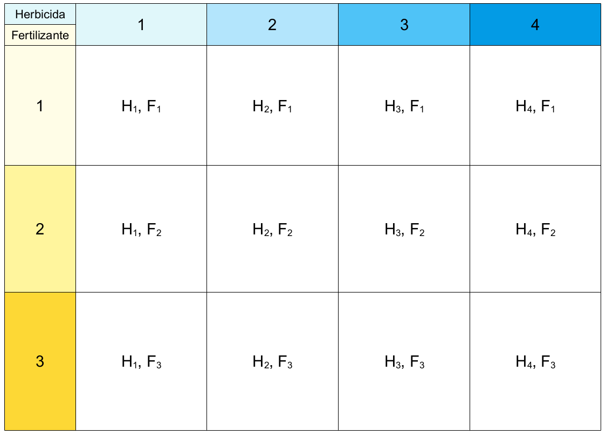

```{r setup, include=FALSE}
knitr::opts_chunk$set(echo = TRUE)
```

# Introducción

Una de las razones por la que los diseños no balanceados requieren una estrategia diferente de suma de cuadrados es que ésta --la suma de cuadrados-- será artificialmente *mayor* para los tratamientos o factores que tengan más unidades experimentales, de modo que, aunque dichos factores o tratamientos carezcan de poder explicativo, sus sumas de cuadrados serán mayores que las de factores o tratamientos con menos unidades. 

Hay muchas razones por las cuales los estudios pueden quedar fuera de balance, desde fallas de diseño, errores o accidentes experimentales u observacionales, hasta dificultades logísticas. Para todos esos casos existe la solución estadística de la suma de cuadrados **Tipo II**.

Existe otro tipo de diseños no balanceados con efectos fijos cuando por ejemplo faltan algunas combinaciones de los niveles de los dos factores experimentales (Figura \@ref(fig:No-balance-1)). Este tipo de diseños también se pueden analizar con suma de cuadrados tipo II.

```{r No-balance-1, echo = F, fig.cap="Diseño experimental no balanceado por falta de combinaciones de factores", fig.align = "center"}

```

# La suma de cuadrados **Tipo II**

La suma de cuadrados **Tipo I** se hace de manera secuencial:

1. $SS(A)$
2. $SS(B|A)$
3. $SS(AB|A, B)$

Lo que quiere decir que primero se obtiene la suma de cuadrados del factor $A$, después la del factor $B$ en relación al factor $A$ y finalmente la de la interacción $AB$ en relación a la suma de cuadrados de $A$ y de $B$. En la sumade cuadrados tipo II siempre se debe hacer:

1. $SS(A|B)$
2. $SS(B|A)$
3. $SS(AB|A, B)$

Siempre se ajusta la suma de cuadrados en relación a la de los otros factores.

Esta suma de cuadrados en **R** no está disponible pod default, pero se encuentra implementada en el paquete `car` disponible en cualquier distribución de **R**.

# Aplicación en **R**

Para este tutorial utilizaremos la misma base de datos `ToothGrowth` pero eliminaremos selectivamente observaciones o combinaciones de niveles de alguno de los factores.

## Pérdida de unidades experimentales

Comenzaremos por cargar la base de datos y eliminar 20 datos aleatoriamente y ver cómo queda el balance después de la eliminación

```{r}
set.seed(21)
datos <- ToothGrowth
datos$dose <- as.factor(paste0("D", datos$dose))

datos <- datos[sample(1:60, 40), ]

table(datos$supp)
table(datos$dose)
```

Como podemos apreciar el diseño quedó fuera de balance en varios de los niveles de los factores. Haremos primero ANOVA con suma de cuadrados tipo I:

```{r}
modelo.1 <- lm(len ~ supp * dose, data = datos)
anova(modelo.1)
```

Podemos ver que los resultados son muy parecidos a los del [análisis balanceado](Diseño-balance-fijos.html), pero en este caso ya no podemos demostrar si la interacción es significativa.

Comparemos entonces los resultados con los que se obtienen utilizando suma de cuadrados tipo II:

```{r}
library(car)
Anova(modelo.1, type = "II")
```

Aquí cambiaron un poco los niveles de significancia, pero lo que sí cambió mucho fue las sumas de cuadrados de `supp`, pues estas ya no son las que se usan como referencia, ahora estas están calculadas en relación a `dose`. Y también con la suma de cuadrados tipo II para ajustar en ausencia de balance perdemos la interacción `supp:dose`

## Pérdida de niveles de un factor

Volvamos a cargar la base de datos para eliminar los datos de las combinaciones `OJ-D1`:

```{r}
datos.2 <- ToothGrowth
datos.2$dose <- as.factor(paste0("D", datos.2$dose))
datos.2$len[datos.2$supp == "OJ" & datos.2$dose == "D1"] <- NA
datos.2 <- na.omit(datos.2)
```

Y hagamos un gráfico de caja para verificar que falten esas combinaciones de tratamientos:

```{r Cajas-trat-falt, fig.height=4.5, fig.width=6, fig.cap="Gráfico de cajas del diseño con combinaciones faltantes.", fig.align="center"}
boxplot(len ~ supp + dose, data = datos.2)
```

Entonces haremos el análisis de este diseño desbalanceado, viendo las diferencias entre $SS$ I y $SS$ II:

```{r}
modelo.2 <- lm(len ~ supp * dose, data = datos.2)
anova(modelo.2)
Anova(modelo.2, type = "II")
```


[Regresar al índice del curso](../index.html)


