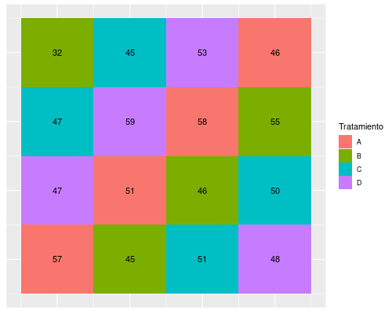

```{r setup, include=FALSE}
knitr::opts_chunk$set(echo = FALSE)
```

# Introducción al cuadrado latino

## Historia y cualidades

1. Desarrollado para:

      1.1. Aumentar condiciones externas en experimentos
      
      1.2. Combinar varios factores

2. Arreglo en filas y columnas de factores experimentales

      2.1. Cada factor aparece 1 vez por fila y columna
      
      2.2. Factor con $N$ niveles $\rightarrow$ cuadro $N \times N$
      
## Combinación de varios factores

$$ \mathrm{Factor\ A} = \{a, b, c \} $$
$$ \mathrm{Factor\ B} = \{\alpha, \beta, \gamma \}$$

| $a, \alpha$ | $b, \beta$ | $c, \gamma$|
|:---|:---|:---|
| $c, \beta$  | $a, \gamma$| $b, \alpha$ |
| $b, \gamma$ | $c, \alpha$ | $a,  \beta$ |


A este diseño también se le conoce como cuadrado greco-latino

## Resultado de combinaciones

1. Sólo para estudios simétricos (factores con mismo número de niveles)

      1.1. Cuadrados superpuestos

2. Cada combinación aparece 1 vez

3. Estadísticamente:

      3.1. Sólo se estiman efectos aditivos (no hay grados de libertad para interacciones)
      
      3.2. Se necesitan más cuadrados para estimar interacciones
      
            3.2.1. Deben ser aleatorizados
            
# Análisis

## Un sólo cuadrado

1. Cada *bloque* es una réplica

2. $N$ tratamientos = $N$ réplicas

3. Para análisis de 1 sólo factor  en **R**:

```{r echo = T, eval=F}
aov(y ~ x, datos)
lm(y ~ x, datos)
```

4. De dos factores (efectos aditivos únicamente):

```{r echo = T, eval = F}
aov(y ~ x1 + x2, datos)
lm(y ~ x1 + x2, datos)
```

Donde el número de tratamientos de $x_1$ es el mismo que de $x_2$

## Más de un cuadrado

1. Cada cuadrado aleatorizado = bloque

2. Todos los tratamientos están contenidos en cada bloque

3. Factor de agrupamiento es el bloque

      3.1. Efecto aleatorio por bloque
      
      3.2. Bloques necesarios para interacciones = Tratamientos + 1

4. El análisis:

```{r echo = T, eval = F}
aov(y = x1 * x2 + Error(bloque/(x1*x2)), datos)
```

## Modelos alternativos

1. Frecuentemente en diseños CL se considera que

      1.1. Hay dos factores de agrupación --filas y columnas
      1.2. Es posible modelarlos con efectos aleatorios
      
```{r echo = T, eval = F}
library(lme4)
lmer(y ~ x1 + x2 + (1|filas) + (1|columnas), datos)
```

El modelo es aditivo porque no podemos ajustar la interacción $x_1 : x_2$

# Limitaciones

## Logísticas

```{r out.width="50%", fig.cap="Diseño de cuadrado latino simple", fig.align='center'}
knitr::include_graphics("../Unidad 1-Introducción/Fertilizante-cuadrado.png")
```

## Logísticas

1. Complejidad crece a ritmo $N^2$

2. Pocos tratamientos = Pocos grados de libertad

3. Se recomienda:

      3.1. $4 \geq N \leq 8$

4. Si interacciones biológicas son posibles $\rightarrow$ **EVITAR**
      
## Ventajas

```{r out.width="70%", fig.align='center', fig.cap="Diseño de cuadrado latino con cuatro tratamientos (no balanceado)."}

```

## Consideraciones

1. Muy útil cuando hay un gradiente espacial

      1.1. Cualidades heterogéneas del suelo
      
      1.2. Efecto de borde en invernadero
      
2. Si no hay un gradiente que tomar en cuenta $\rightarrow$ **EVITAR**


[Regresar al índice del curso](../index.html)