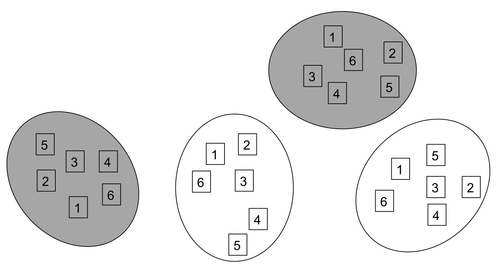
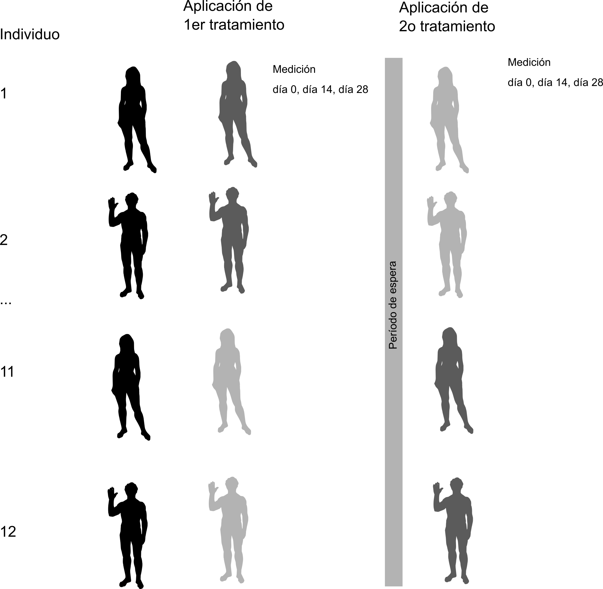
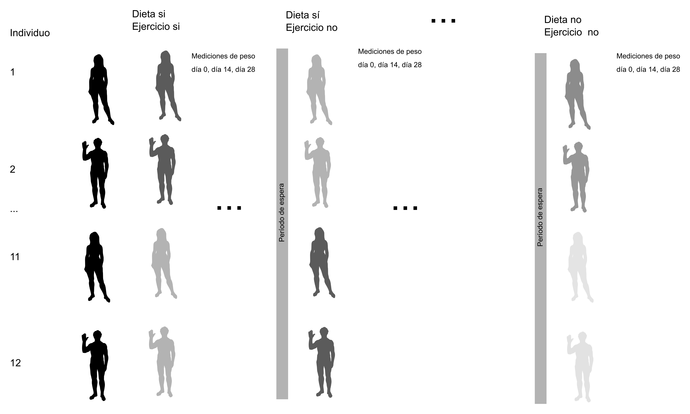

```{r setup, include=FALSE}
knitr::opts_chunk$set(echo = FALSE)
```

## Diferencias con split-plot

1. Diferencias con Split-plot

      1.1 Split-plot - Anidamiento espacial
      
      1.2 Medidas repetidas - Anidamiento temporal
      
2. Experimentos de medidas repetidas suelen ser largos

3. Split-plot - se pueden reconfigurar como estudio aleatorizado

4. Medidas repetidas

      4.1. Sólo reconfigura si repetición es por diferentes tratamientos
      
## Ejemplos

Split-plot

```{r echo=F, fig.cap="Estudio split-plot con anidamiento espacial"}

```

## Ejemplos

Medidas repetidas

```{r echo =FALSE, fig.cap="Estudio de medidas repetidas con anidamiento temporal", out.width="50%", fig.align='center'}

```

## Consecuencias para análisis

- Medidas repetidas

      - Estrictamente anidado
      
      - Especificación de modelo: `y ~ x1/x2/x3 + Error(bloque/x1/x2/x3)`
      
- Split-plot

      - Parcialmente anidado
      
      - Especificación de modelo: `y ~ x1 * x2 * x3 + Error(bloque/x1/x2/x3)`
      
# Análisis de `weightloss`

## Weightloss

1. Medición de pérdida de peso

      1.1. Tratamientos de dieta y ejercicio
      
      1.2. Controles -  no dieta y no ejercicio
      
      1.3. Mediciones repetidas en tiempo
      
      1.4. Todos los participantes recibieron ambos tratamientos y combinaciones
      
## Esquema

```{r echo = F, fig.cap="Esquema del diseño experimental, es similar a `selfesteem2` pero es un diseño de tres vías.", out.width="80%", fig.align='center'}

```

## Estructura de anidación

1. Dieta, ejercicio y tiempo están anidados en cada individuo

2. Tiempo está anidado en dieta y ejercicio

3. Dieta y ejercicios no están anidados uno en el otro

Efectos fijos:

```{r echo = T, eval=F}
diet/time * exercises/time
```

Efectos aleatorios-hay dos porque dieta y ejercicio está anidados por separado (hay que usar lmer, a fuerzas):

```{r echo = T, eval=F}
(1|id/exercises/time) + (1/id/diet/time)
```

##  El modelo

```{r echo = F, eval=TRUE, message = F, warning = F, results='hide'}
library(lme4)
weight <- datarium::weightloss
weight.l <- reshape2::melt(weight, id.vars = c("id", "diet", "exercises"))
names(weight.l) <- c("id", "diet", "exercises", "time", "loss")
```

```{r echo = T, eval = T, message=FALSE, warning=FALSE}
m1 <- lmer(loss ~ (diet/time) * (exercises/time) + (1|id/diet/time) +
              (1|id/exercises/time), weight.l)
car::Anova(m1, type = 2)
```

## Pruebas de hipótesis

1. Por su significancia, nos interesa:

      1.1. `diet:time:exercises` - efecto de dieta y ejercicio depende de que estén juntos
      
            1.1.1. Dieta, ejercicio y tiempo sí afectan pérdida
   
      1.2. Tenemos que analizar los coeficientes para revisar si hubo mayor pérdida en la interacción con `summary(m1)` - sí los hubo
   
            1.2.1. Ejercicio + Dieta  + Tiempo = mayor pérdida

[Regresar al índice del curso](../index.html)