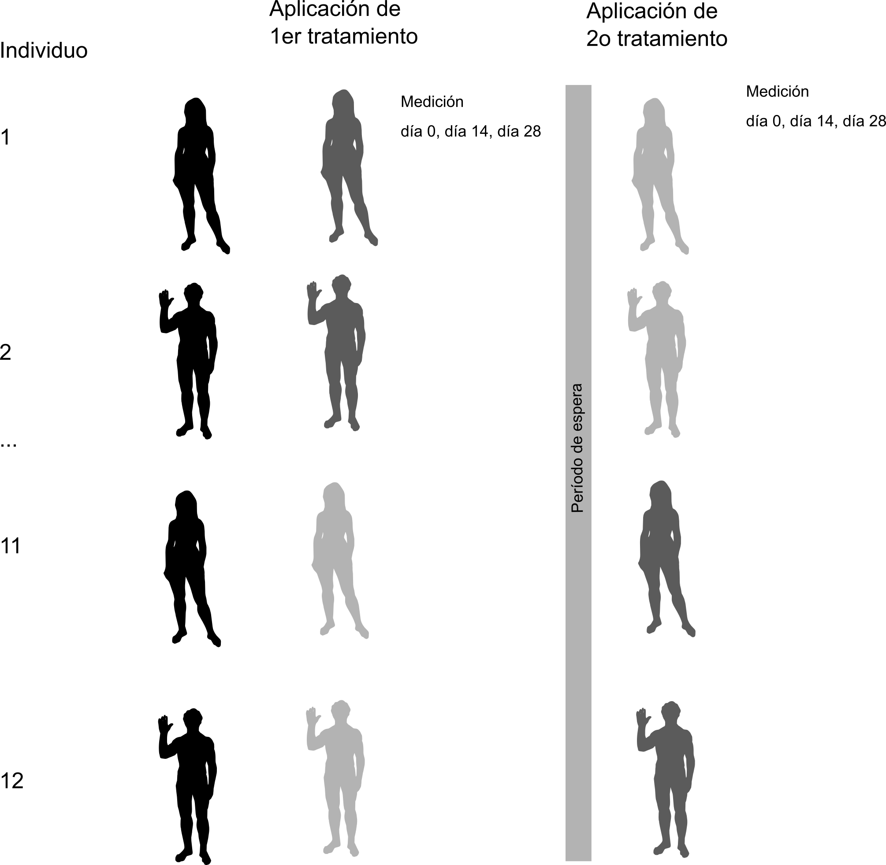

```{r setup, include=FALSE}
knitr::opts_chunk$set(echo = FALSE)
```

## Intro

- Split-plot = Parcelas divididas

- Aquí, parcela = bloque $\approx$ tratamiento

- Cada bloque contiene todos tratamientos de otro factor

# Ejemplos

## Reclutamiento vs Competencia-Régimen hídrico

1. Reclutamiento

      1.1. Larvas de dos especies que llegan a adulto

2. Competencia

      2.1. Densidad de *Spp* 1 vs Densidad de *Spp* 2 
      
3. Régimen hídrico
      
      3.1. Posas inundadas permanentemente vs efímeras

## El diseño

```{r fig.cap="Diseño de Wissinger et al. (1996)"}
knitr::include_graphics("Wissinger-1.png")
```

## Diseño alternativo

```{r fig.align='center', fig.cap= "Diseño alternativo completamente aleatorizado"}
knitr::include_graphics("Wissinger-alt.png")
```

## Ventajas y Desventajas

```{r}
df.1 <- data.frame(
      Split_plot = c("Logística más simple",
                     "Menos unidades experimentales",
                     "Menor varianza ambiental",
                     "Pérdida de un tratamiento afecta\ muchas unidades"),
      Aleatorizado = c("Logística más complicada",
                       "Más unidades experimentales",
                       "Mayor varianza ambiental",
                       "Pérdida de unidad sólo afecta a esa combinación de factores")
)

knitr::kable(df.1, caption = "Ventajas y desventajas de cada diseño.")
```

## Análisis estadístico

```{r}
df.2 <- data.frame(
      Split_plot = c("Modelo de efectos mixtos",
                     "Efectos aleatorios según anidamiento",
                     "Efectos fijos = Aditivos e interacciones"),
      Aleatorizado = c("Modelo de efectos fijos (depende)",
                       "Efectos aleatorios si hay bloques",
                       "Efectos fijos = Aditivos e interacciones")
)

knitr::kable(df.2, caption = "Comparación de análisis estadístico de ambos diseños.")
```

## Conclusiones

1. En split-plot **siempre** hay algún tratamiento anidado en otro

2. Anidamiento resulta, casi siempre, de algún componente espacial

3. Los diseños anidados **siempre** requieren especificar correctamente la estructura de anidación

4. Los diseños anidados **siempre** requieren de réplicas

# Análisis estadístico

## Especificación de estructura de anidación

1. En Wissinger et al. (1996)

      1.1. Régimen contiene a densidad
      
      1.2. Anidación se especifica con operador `/`:
      
`x1/x2 = x1 + x1:x2`

2. En Wissinger et al. (1996):

```{r echo = TRUE, eval=FALSE}
m <- aov(Reclutamiento ~ Regimen / Densidad + Error(Densidad/Bloque),
              data = Wissinger)
```


## Análisis de `selfesteem2`

1. Es un diseño de medidas repetidas, pero el concepto es el mismo, los tratamientos está anidados en cada individuo.

2. El experimento

      2.1. **Objetivo** Medir efecto de dieta y tiempo de consumo sobre el nivel de autoestima
      
      2.2. **Diseño** 12 participantes que recibieron, cada uno, dieta y control
            
      2.3. **Medición de autoestima** 3 veces, en las 4 semanas de dieta y control
      
## Esquema de `selfesteem`

```{r fig.align='center', fig.cap="Esquema del diseño de `selfesteem2`.", out.width="60%"}

```

## Análisis

1. Estructura de anidamiento

      1.1. Ambos tratamientos están anidados en cada individuo
      
      1.2. Tiempo está anidado en dieta
      
      1.3. `tratamiento` y `tiempo` contenidos en `id` $\rightarrow$ efectos aleatorios para `id`
      
```{r echo=T, eval=F}
m1 <- aov(auto ~ tratamiento / tiempo + Error(id),
          selfesteem2)
m2 <- lmer(auto ~ tratamiento / tiempo + (1|id),
           selfesteem2)
```

El primer término dentro de `Error` es el bloque experimental (el individuo), el segundo, es el tratamiento que agrupa los niveles del segundo factor, y el tercero, es el factor anidado.

# Analicemos `selfesteem2`

## El análisis sin efectos aleatorios

- Sin efectos aleatorios

```{r eval = T, echo = F}
auto <- datarium::selfesteem2
auto.l <- reshape2::melt(auto, id.vars = c("id", "treatment"))
names(auto.l) <- c("id", "tratamiento", "tiempo", "auto")
```

```{r echo = T, eval = T}
m1 <- aov(auto ~ tratamiento / tiempo, auto.l)
summary(m1)
```

## Resultado

1. Es probable que podamos:

      1.1. Rechazar $H_0,\ \mathrm{dieta} \neq \mathrm{control}$, 
      
      1.2. No rechazar $H_1,\ t_1 = t_2 = t_3$ y $H_2$ (interacciones)
      
## Con efectos aleatorios

```{r echo = T, eval = T}
m2 <- aov(auto ~ tratamiento / tiempo + Error(id/tratamiento/tiempo),
          auto.l)
```

Tenemos que espeficicar cómo los factores están contenidos --anidados-- en los bloques o individuos, `id`.

## El resultado
```{r echo = F, eval = T}
summary(m2)
```

## Conclusión

1. Los resultados cambian radicalmente

      1.1. Variabilidad del valor de autoestima entre individuos enmascara efectos para cada individuo
      
      1.2. Tomar en cuenta anidamiento, revela que la dieta y el tiempo de consumo sí afectan autoestima
      
      1.3. Para ver los efectos expecíficos, hay que ver las medias de `auto` en cada grupo experimental ([ver lección](Split-plot.html))

[Regresar al índice del curso](../index.html)