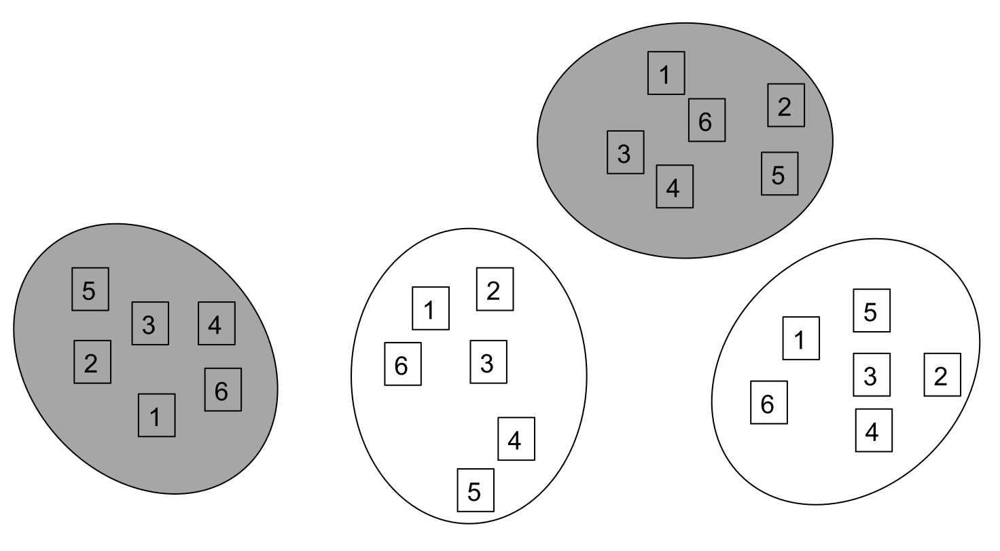

```{r setup, include=FALSE}
knitr::opts_chunk$set(echo = TRUE)
```

# Introducción

El diseño split-plot, o de parcelas divididas fue diseñado para combinar factores que tienen escalas espaciales dispares. Como la mayoría de métodos de diseño y análisis de experimentos fueron diseñados en agricultura, el ejemplo clásico de este diseño sería la combinación de tipos de suelo y fertilizante. El tipo de suelo es un atributo geográfico que es difícil de manipular, por lo que el diseño más práctico es la identificación de parcelas con cada los tipos de suelo de interés y aplicar los fertilizantes a cada tipo de suelo ([Yates 1935](https://www.jstor.org/stable/2983638?seq=1); figura \@ref(fig:split-plot)).

```{r split-plot, echo=F, fig.height=4, fig.width=6, fig.align='center', fig.cap="Esquema de un diseño split-plot. Los colores indican los tipos de suelo y las letras los fertilizantes aplicados en cada tipo de suelo. El esquema no muestra ningún tipo de disposición espacial de las unidades experimentales y es meramente ilustrativo del concepto.", message = F}
source("../Random-functions/Shuffle.R")
df.1 <- expand.grid(x = 1:3, y = 1:2)
df.1$Suelo <- rep(LETTERS[1:3], 2)
x.fert <- c(0.75, 1.25, 1.75, 2.25, 2.75, 3.25)
y.fert <- c(1,2)

xy.fert <- expand.grid(x = x.fert, y = y.fert)
xy.fert$Fertilizante <- rep(LETTERS[4:5], 6)

library(ggplot2)

ggplot() + geom_tile(aes(x = x, y = y, fill = Suelo), data = df.1) + 
      geom_text(aes(x = x, y = y, label = Fertilizante), data = xy.fert) +
      geom_hline(aes(yintercept = 1.5), colour = "grey95") + 
      geom_vline(aes(xintercept = c(1.5, 2.5)), colour = "grey95") +
      theme(legend.position = "none",
            axis.text = element_blank(),
            axis.title = element_blank(),
            axis.ticks = element_blank())
```
Una de las consecuencias de este diseño experimental es que uno de los factores (tipo de suelo en este caso), se convierte en un factor de agrupación de otro factor experimental. A dicha agrupación de un factor experimental dentro de otro se le conoce como **anidación**, la cual da origen a un **diseño anidado**. Es importante saber identificar la anidación porque el factor experimental que está anidado (fertilizante) dentro de otro factor será afectado por las fuentes de variabilidad que ocurren dentro del factor de anidación (tipo de suelo). Entonces, el análisis de un diseño anidado requiere de una especificación diferente a los modelos que hemos visto a la fecha. Debido a que el componente aleatorio de un diseño anidado está relacionado con el factor experimental de anidación, es necesario contar con réplicas verdaderas de este factor.

A diferencia de los diseños con efectos aleatorios y mixtos que vimos anteriormente, la especificación de los efectos aleatorios en los diseños split-plot es un poco más complicada, pues depende de los factores de anidación y los factores anidados. Una incorrecta especificación de los efectos aleatorios en relación a los factores de anidación y los anidados resultará en la estimación incorreta de efectos y sus significancias, debido a que los grados de libertad por tratamiento cambian dependiendo de la estructura de anidación, lo que afecta las estimaciones del estadístico $F$ y la significancia estadística (valores de $P$).

## Ejemplos de diseños split-plot

Es común que los diseños split-plot tengan un componente espacial difícil de manipular aunque hay excepciones. Por ejemplo, hay muchos estudios clínicos donde los individuos participantes son sujetos a diferentes tratamientos o a medidas repetidas. Tratamientos diferentes que puedan ser aplicados al mismo individuo podrían ser medicamentos tópicos (en la piel) para tratar condiciones generalizadas, aquellos que requieran observaciones repetidas del efecto acumulado de otro medicamento (común en psiquiatría). En ecología, la mayoría de los diseños split-plot tienen un componente espacial importante.

### Competencia entre larvas de tricópteros 

[Wissinger et al. (1996)](https://esajournals.onlinelibrary.wiley.com/doi/abs/10.2307/2265743) estudiaron el efecto de la competencia sobre el reclutamiento de larvas acuáticas (metamórfosis a adultos potencialmente reproductores) de los tricópteros *Asynarchus nigriculus* y *Limnephilus externus*. El experimento consistió en crear condiciones que regularan la competencia entre larvas por medio del regímen hídrico y la densidad poblacional de cada especie. Para hacer ello Wissinger et al. seleccinaron sitios a las orillas de una posa más grande con regímenes de inundación permanente y efímera. En cada sitio colocaron seis cajas de madera que contenían seis niveles de densidad poblacional de cada especie tricóptero (Figura \@ref(fig:Wissinger)).

```{r Wissinger, echo = F, fig.align="center", fig.cap="Esquema del diseño experimental split-plot de Wissinger et al. (1996), tomado de [Quinn et al. (2012)](https://www.cambridge.org/core/books/experimental-design-and-data-analysis-for-biologists/BAF276114278FF40A7ED1B0FE77D691A). Los colores gris y blanco indican el tipo de régimen hídrico y los números el nivel de densidad poblacional de tricópteros."}

```

#### Críticas al diseño

En este caso, el diseño split-plot era sólo una de las opciones, pues lo autores pudieron haber colocado los contenedores de madera en regiones de la posa con las condiciones deseadas (diseño completamente aleatorizado), aunque ello hubiera resultado en una logística más complicada. La logística más sencilla de mantener cada bloque experimental en el diseño split-plot, sin embargo, hace al experimento más susceptible a la pérdida definitiva de unidades experimentales. 
Desde un punto de vista estadístico, la varianza de los datos en el diseño completamente aleatorizado hubiera sido mucho mayor que en el split-plot.

### Diseños *split-plot* con mediciones repetidas

Los experimentos con mediciones repetidas generalmente se consideran como un diseño distinto al split-plot, aunque en esencia y estadísticamente son equivalentes. Las mediciones repetidas sobre la misma unidad experimental pueden ocurrir tanto con el objetivo de registrar el efecto del tiempo de exposición al tratamiento, como con el objetivo de reducir costos.

#### Efecto del tiempo de exposición al tratamiento

El paquete `datarium` contiene ejemplos de mediciones repetidas con este objetivo. El primero es la base de datos `selfesteem2` (autoestima 2), que consiste del registro del *nivel* de autoestima de 12 individuos inscritos en dos experimentos clínicos para ver el efecto de una dieta especial comparadas con un placebo. A cada individuo se le registró el nivel de autoestima en tres ocasiones durante un período de cuatro semanas que corresponden con el inicio, intermedio y final del experimento. Los mismos individuos participaron en la aplicación de ambos tratamientos (dieta y placebo), por lo que el experimento consta de  medidas repetidas de dos tratamiento en cada individuo (factor de anidación).

```{r echo = F, fig.align="center", fig.cap="Esquema del diseño experimental de `selfesteem2`."}
knitr::include_graphics("Selfeseem2.png")
```

Como en el ejemplo de Wissinger, hay varias alternativas para este experimento. La primera, era aplicar ambos tratamientos a grupos diferentes de pacientes, lo que duplicaría el número de voluntarios para el experimento. Aún así existiría el factor de anidación para las mediciones repetidas del efecto de cada tratamiento en el nivel de autoestima. Para eliminar este último nivel de anidación sería necesario conseguir más voluntarios a quienes se les midiera el *nivel* de autoestima en los diferentes tiempos. Este diseño incrementaría drásticamente la variabilidad, sin mencionar el gran reto logístico de coordinar un experimento de tal magnitud. Para comprender la estructura de los datos, podemos echar un vistazo a la base de datos:

```{r selfesteem, echo = F}
base <- datarium::selfesteem2
knitr::kable(base, caption = "Base de datos de `selfesteem2`, un diseño anidado con mediciones repetidas por tratamiento y en el tiempo por individuo participante. Las columnas `t1`, `t2` y `t3` muestran el nivel de autoestima. `id` es la identidad del individuo participante", align = "c")
```

## Diseños split-plot y la reducción de unidades experimentales

En la primera unidad, en la sección de [Unidad experimental](/..Unidad 1-Introducción/Unidad-exper.html), vimos cómo el diseño experimental puede solventar problemas logísticos , particularmente mediante la aplicación secuencial de tratamientos a unidades experimentales como animales para reducir el número de animales requeridos para completar el experimento (figura \@ref(fig:ratas)).

```{r ratas, echo = F, fig.align="center", fig.cap="Diseño de medidas repetidas mediante la aplicación secuencial aleatoria de tratamientos (colores). Figura original tomada de la [Iniciativa para reducir el uso de animales experimentales](http://www.3rs-reduction.co.uk/)."}
knitr::include_graphics("http://www.3rs-reduction.co.uk/assets/images/expU302.JPG")
```

La reducción de unidades por medio de diseños de medidas repetidas, es posible gracias al desarrollo de las técnicas analíticas para diseños anidados que surgieron con la introducción del diseño split-plot.

# Analisis estadístico de diseños split-plot con **R**

Como se mencionó arriba, en los diseños split-plot hay que saber identificar los factores de anidación para así incluirlos adecuadamente en el análisis. Una errónea especificación llevaría a un uso equivocado de los grados de libertad. Comenzaremos por ver esto con el análisis de `selfesteem`.

## Análisis de `selfesteem2`

La base de datos mostrada en la tabla \@ref(tab:selfesteem) es la que analizaremos ahora. En la tabla podemos ver que hay seis mediciones de autoestima en cada individuo participante, por lo que, para medir el efecto de tiempo hay cinco grados de libertad, y para medir el efecto del tratamiento hay dos (tres observaciones por tratamiento), y el factor de anidación es el individuo (columna `id`). Aquí, el factor `tiempo` está anidado en el factor `tratamiento` y existe un factor de agrupación que corresponde al individuo.  El formato de la base es ancho por lo que hay que transformarla a largo para el análisis:

```{r}
auto <- datarium::selfesteem2
auto.l <- reshape2::melt(auto, id.vars = c("id", "treatment"))
names(auto.l) <- c("id", "tratamiento", "tiempo", "auto")
```

Para comenzar, veremos cómo se distribuyen los datos alrededor de la media, y si éstos se desvían significativamente de la normalidad con `shapiro_test`:

```{r box-self, fig.height=4, fig.width=8, fig.cap="Gráfico de cajas del nivel de autoestima en función del tiempo y la dieta.", fig.align="center"}
boxplot(auto ~ tiempo + tratamiento, auto.l)
```

```{r message = F, warning = F}
library(tidyverse); library(rstatix)
shap.test <- auto.l %>%
   group_by(tratamiento, tiempo) %>%
   shapiro_test(auto)
knitr::kable(shap.test, caption = "Resultados de la prueba de Shapiro dentro de cada grupo experimental.", align = "c")
```

Con esto podemos ver que sólo hay una combinación de tratamientos que se desvía significativamente de la normalidad. Ahora sí, continuemos con el análisis utilizando `aov`. Comenzaremos por ver qué inferiríamos sobre $H_0$ si omitimos la estructura de anidamiento y  los efectos aleatorios:

```{r}
m1 <- aov(auto ~ tiempo * tratamiento, auto.l)
summary(m1)
```

A estas alturas, nos resulta evidente que hay pocas razones para rechazar las hipótesis, nulas, excepto por el efecto de `tratamiento`. Como ya sabemos, los datos de este experimento fueron generados con un diseño split-plot. En este experimento, ambos factores están anidados en los individuos, y `tiempo` está anidado en `tratamiento`, de modo que en `aov` debemos especificarlo en la fórmula y en los efectos aleatorios. Prosigamos primero, especificando un modelos con los factores anidados de acuerdo con su estructura: `tratamiento` contiene a `tiempo`, por lo que:


```{r}
m2 <- aov(auto ~ tratamiento / tiempo , auto.l)
summary(m2)
```

Como podemos ver, cuando el modelo esta anidado, no se puede separar el efecto del factor de anidacion del factor anidado, de modo que **SIEMPRE** se estima la interacción, y podemos ver que la conclusió sobre $H_0$ sigue siendo la misma, aunque nos queda por tomar en cuenta al individup, `id`, como efecto aleatorio:

```{r message = F, warning = F}
library(lme4)
m3 <- lmer(auto ~ tratamiento / tiempo + (1|id), auto.l)
car::Anova(m3, type = 2)
```

Como podemos ver, las conclusiones serían completamente diferentes entre un método y otro. Cuando incluimos correctamente los efectos aleatorios (variación entre individuos en el valor de `auto`), rechazamos todas las hipótesis nulas, particularmente sobre la interacción `tratamiento:tiempo`, con lo que concluimos que el efecto del tratamiento con dieta depende del tiempo que ésta dure, pues como resulta evidente en la figura \@ref(fig:box-self), el nivel de autoestima incrementa con el tiempo cuando los individuos consumieron la dieta en comparación con el control, donde el nivel de autoestima disminuyó con el tiempo.

[Regresar al índice del curso](../index.html)

