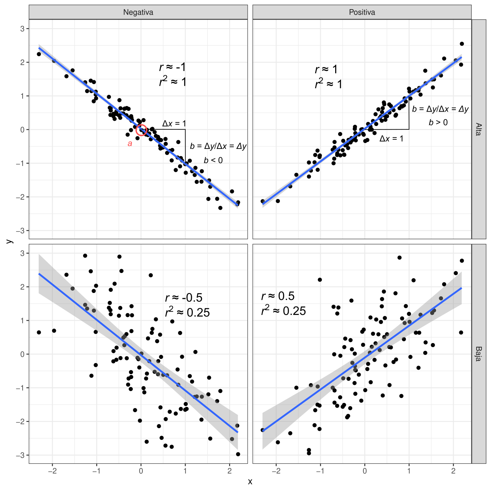

```{r setup, include=FALSE}
knitr::opts_chunk$set(echo = FALSE)
```

## Diferencias con experimentos factoriales

1. ANOVA - Variables independientes son categóricas, valores no indican magnitud:

```{r catego, echo = F, fig.align='center', out.width="80%", fig.cap="Variables categóricas."}

```

      1.1. Compuestos fertilizantes, tipos de suelo, especies de organismos

## Diferencias con experimentos factoriales

1. Regresión y correlación - Variables independientes contínuas, valores indican magnitud:

```{r contin, echo = F, fig.align='center', out.width="80%", fig.cap="Variables contínuas"}

```

      1.1. Temperatura, concentración de un fertilizante, frecuencia de riego

## Diferencias con experimentos factoriales

1. Hipótesis

      1.1. ANOVA - efecto de tratamientos sobre **valor medio en grupo experimental** (un parámetro por nivel o tratamiento)
      
            - Diferencias entre tratamientos
      
      1.2. Regresión - efecto de variable sobre **cambio del valor medio** en relación a variable independiente
      
            - Magnitud y fuerza del efecto

## Diferencias y similitudes entre Corr y Reg

1. Ambas describen asociaciones entre variables

      1.1. Pueden medir *fuerza* de asociación
      
2. Regresión mide el cambio cuantitativo entre una y otra

      2.1. Asume relación causa-efecto
      
3. Correlación no mide cambio

      3.1. No asume causa-efecto

## Causa-efecto

1. Correlación de $x$ con $y$ = Correlación de $y$ con $x$

2. Regresión de $x$ con $y \neq$ Correlación de $y$ con $x$

      2.1. Regresión asume que $y(x) = a + b x$
      
      2.2. $y$ es producida por $x$
            
      2.3. $a$ y $b$ ajustan unidades y tasa de cambio
      
3. ¡**REGRESIÓN SE USA PARA ESTIMAR** $a$ y $b$!

## Relaciones lineales

```{r rel-lin, fig.height=4, fig.width=4, fig.align="center", fig.cap="Relación lineal entre dos variables aleatorias $x, y$.", echo=FALSE, message = F, warning = F}
library(ggplot2)

set.seed(123)
x <- rnorm(100, 0, 1)
y <- x + rnorm(100, 0, 1)

df.1 <- data.frame(x = x, y = y)
ggplot(df.1) + geom_point(aes(x = x, y = y)) + 
      geom_smooth(aes(x = x, y = y), method = "lm") +
      theme_bw()
```

## Fuerza de asociación

1. Correlación $\rightarrow$ estimar coeficiente de correlación $r$ (varianza de una explicada por la otra):

      1.1. Decribe tanto *fuerza* como *dirección*

2. Regresión $\rightarrow$ estimar coeficiente de determinación $r^2$

      2.1. Decribe *fuerza*, la dirección es medida por $b$
      
## Ejemplos

```{r correlacion, echo=F, fig.align='center', fig.height=6, fig.width=6, warning=F, message=F, out.width="60%"}
y1 <- x + rnorm(100, 0, 0.2)
y2 <- -x + rnorm(100, 0, 1)
y3 <- -x + rnorm(100, 0, 0.2)

df.1$Correlación <- "Baja"
df.1$Signo <- "Positiva"

df.2 <- data.frame(x = x, y = y1)
df.2$Correlación <- "Alta"
df.2$Signo <- "Positiva"

df.3 <- data.frame(x = x, y = y2)
df.3$Correlación <- "Baja"
df.3$Signo <- "Negativa"

df.4 <- data.frame(x = x, y = y3)
df.4$Correlación <- "Alta"
df.4$Signo <- "Negativa"

df.5 <- rbind(df.1, df.2, df.3, df.4)

ggplot(df.5) + geom_point(aes(x = x, y = y)) + 
      geom_smooth(aes(x = x, y = y), method = "lm") + 
      facet_grid(vars(Correlación), vars(Signo)) + 
      theme_bw()
```

## Interpretación de coeficientes

1. Correlación

      1.1. $1 \geq r \leq -1$
      
      1.2. $r > 0$, $y$ aumenta si $x$ aumenta
      
      1.3. $r < 0$, $y$ disminuye si $x$ aumenta
      
      1.4. $r = 0$, $y$ no cambia con $x$
      
      1.5. $r = \{1, -1\}$, $y$ forma línea recta perfecta con $x$
      
## Interpretación de coeficientes

1. Regresión

      1.1. $0 \geq r^2 \leq 1$
      
      1.2. $r = 0$, $y$ no cambia con $x$
      
      1.3. $r = 1$, $y$ forma línea recta perfecta con $x$
      
      1.4. $-\infty \geq \{ a, b \} \leq \infty$
      
      1.5. $b > 0$, $y$ aumenta si $x$ aumenta
      
      1.7. $b < 0$, $y$ disminuye si $x$ aumenta
      

## Ejemplos gráficos

```{r echo = F, fig.align="center", fig.cap="Coeficientes de regresión y correlación.", out.width="60%"}

```

# Fin


[Regresar al índice del curso](../index.html)
      
